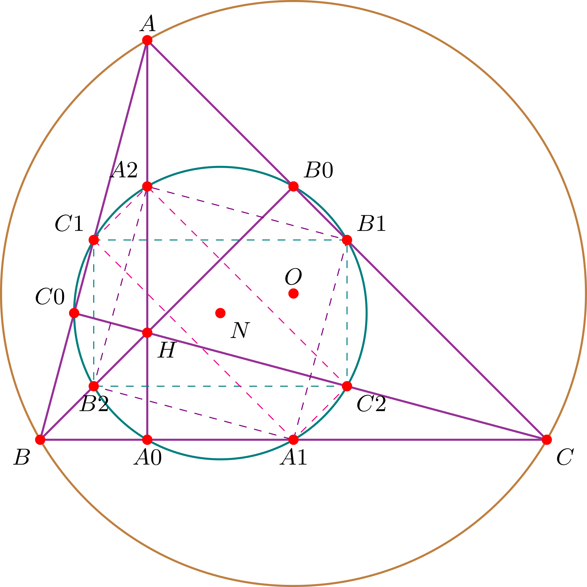
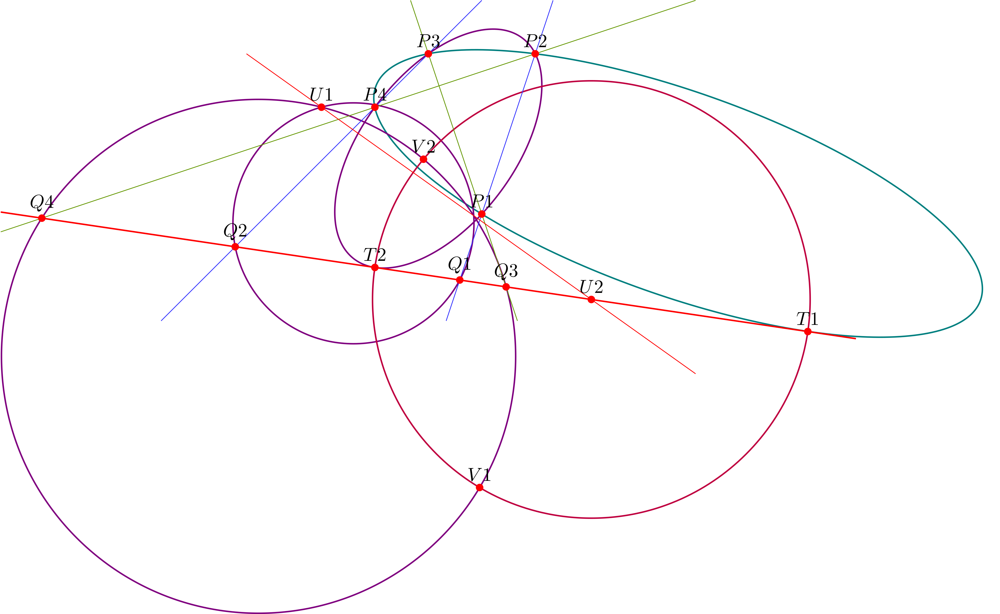

# Cartes: The Missing Geometry Computation Library for TikZ

## Introduction

`tikz-cartes` is a powerful extension library for TikZ, specifically engineered for analytical geometry calculations and the rendering of plane geometry, spatial vectors, and conic sections. By introducing robust vector operations and matrix transformation capabilities, it fundamentally revolutionizes the traditional TikZ drawing workflow. In conventional TikZ usage, users are often burdened with manual coordinate calculations or limited to the basic linear interpolations provided by the `calc` library. This library bridges the gap between advanced mathematical computation and graphical synthesis, enabling users to perform vector and matrix operations directly within LaTeX code. It allows for the execution of complex geometric tasks—such as finding intersections, poles, and applying matrix transformations—entirely within the LaTeX environment, complemented by a suite of concise drawing commands.

## Core Features

- **Matrix Computation:** Supports matrix arithmetic, solving systems of linear equations, and calculating eigenvalues and eigenvectors.
- **Vector Computation:** Supports dot products, cross products, projections, reflections, and rotation operations for both 2D and 3D vectors.
- **Triangle Centers:** Easily determine the incenter, circumcenter, centroid, orthocenter, and excenters of a triangle.
- **Circle & Line Calculus:** Supports the calculation of radical axes, common tangents, inversion points, and intersections between circles and lines.
- **Conic Sections:** Utilizes homogeneous coordinates to define conic sections via five points, five lines, or focus-directrix parameters.
- **Drawing Commands:** Provides the `\segment` and `\conic` commands to automatically handle the parameterized plotting of lines and conic sections.

## Examples

### Nine-point Circle

The following code demonstrates the classic **Euler Line** and the **Nine-Point Circle** theorem using the `tikz-cartes` library.

```latex
\documentclass[tikz]{standalone}
\usepackage{tikz}
\usetikzlibrary{cartes}

\begin{document}
\begin{tikzpicture}
  \tikzmath{
    % Define vertices of the triangle using polar coordinates
    \A{1} = 4 * cos(120); \A{2} = 4 * sin(120);
    \B{1} = 4 * cos(210); \B{2} = 4 * sin(210);
    \C{1} = 4 * cos(-30); \C{2} = 4 * sin(-30);
  }
  \tikzset{
    % --- Orthic Triangle Construction ---
    % Project vertices onto opposite sides to find altitude feet (Ai, Bi, Ci)
    plane/project={\B,\A,\C,\Ai},
    plane/project={\C,\B,\A,\Bi},
    plane/project={\A,\C,\B,\Ci},
    % --- Medial Triangle Construction ---
    % Find midpoints of the sides (Aj, Bj, Cj)
    plane/scale={\B,\C,0.5,\Aj},
    plane/scale={\C,\A,0.5,\Bj},
    plane/scale={\A,\B,0.5,\Cj},
    % --- Triangle Centers & Euler Line ---
    % Compute the Orthocenter (H) and Circumcenter (O)
    plane/orthocenter={\A,\B,\C,\H},
    plane/circumcenter={\A,\B,\C,\O},
    % The Nine-point center (N) is the midpoint of the Euler line segment OH
    plane/scale={\O,\H,0.5,\N},
    % --- Euler Points ---
    % Find midpoints between vertices and the orthocenter (Ak, Bk, Ck)
    plane/scale={\A,\H,0.5,\Ak},
    plane/scale={\B,\H,0.5,\Bk},
    plane/scale={\C,\H,0.5,\Ck},
    % --- Geometric Radii ---
    % Circumradius (Radius) and Nine-point radius (radius)
    plane/length={\O,\A,\Radius},
    plane/length={\N,\Ai,\radius},
  }
  
  % Convert calculated vectors/points to TikZ coordinates
  \coordinate (A) at (\A{1},\A{2});
  \coordinate (B) at (\B{1},\B{2});
  \coordinate (C) at (\C{1},\C{2});
  \coordinate (O) at (\O{1},\O{2});
  \coordinate (H) at (\H{1},\H{2});
  \coordinate (N) at (\N{1},\N{2});
  \coordinate (A0) at (\Ai{1},\Ai{2});
  \coordinate (B0) at (\Bi{1},\Bi{2});
  \coordinate (C0) at (\Ci{1},\Ci{2});
  \coordinate (A1) at (\Aj{1},\Aj{2});
  \coordinate (B1) at (\Bj{1},\Bj{2});
  \coordinate (C1) at (\Cj{1},\Cj{2});
  \coordinate (A2) at (\Ak{1},\Ak{2});
  \coordinate (B2) at (\Bk{1},\Bk{2});
  \coordinate (C2) at (\Ck{1},\Ck{2});

  % Draw the Circumcircle (brown) and the Nine-Point Circle (teal)
  \draw[thick,brown] (O) circle (\Radius);
  \draw[thick,teal] (N) circle (\radius);

  % Draw the reference triangle and its altitudes
  \draw[thick,violet!80] (A) -- (B) -- (C) -- cycle;
  \draw[thick,violet!80] (A) -- (A0) (B) -- (B0) (C) -- (C0);

  % Draw auxiliary quadrilaterals connecting midpoints and Euler points
  \draw[dashed,violet] (A1) -- (B1) -- (A2) -- (B2) -- cycle;
  \draw[dashed,teal] (B1) -- (C1) -- (B2) -- (C2) -- cycle;
  \draw[dashed,magenta] (C1) -- (A1) -- (C2) -- (A2) -- cycle;

  % Label all critical points
  \foreach \p/\placement in {A/above,B/below left,C/below right,
  A0/below,B0/above right,C0/above left,
  A1/below,B1/above right,C1/above left,
  A2/above left,B2/below,C2/below right,
  O/above,H/below right,N/below right}{
    \fill[red] (\p) circle (2pt);
    \draw (\p) node[\placement] {\small $\p$};
  }
\end{tikzpicture}
\end{document}
```



### Conic Section on Four Points and One Line

The following code demonstrates the construction of  conics passing through four points and tangent to a given straight line.

```latex
\documentclass[tikz]{standalone}
\usepackage{tikz}
\usetikzlibrary{cartes}

\begin{document}
\begin{tikzpicture}
  \tikzmath{
    % Define 5 points in homogeneous coordinates (x, y, w) 
    % These serve as the basis for the initial conic construction.
    \Pa{1,1} = 1; \Pa{2,1} = 1; \Pa{3,1} = 1; 
    \Pb{1,1} = 2; \Pb{2,1} = 4; \Pb{3,1} = 1; 
    \Pc{1,1} = 0; \Pc{2,1} = 4; \Pc{3,1} = 1; 
    \Pd{1,1} = -1; \Pd{2,1} = 3; \Pd{3,1} = 1; 
    \Pe{1,1} = -1; \Pe{2,1} = 0; \Pe{3,1} = 1; 
    % Define a point for auxiliary circle construction
    \Ua{1,1} = -2; \Ua{2,1} = 3; \Ua{3,1} = 1;
  }
  \tikzset{
    % Define the original conic passing through the five points
    conics/define/five points={\Pa,\Pb,\Pc,\Pd,\Pe,\A},
    % Compute the tangent line \Le at point \Pe using the pole-polar relationship
    conics/polar={\A,\Pe,\Le},
    mat/stdout={\A,3,3},
    % --- Construct a Complete Quadrilateral and Involution Points ---
    % Find intersection lines (pencils) between pairs of points
    conics/cross={\Pa,\Pb,\Lab}, % 1-2
    conics/cross={\Pc,\Pd,\Lcd}, % 3-4
    conics/cross={\Pa,\Pc,\Lac}, % 1-3
    conics/cross={\Pb,\Pd,\Lbd}, % 2-4
    % Determine intersection points of these lines with the tangent line \Le.
    % (Qa, Qb) and (Qc, Qd) form pairs of involution points on the tangent line.
    conics/cross={\Lab,\Le,\Qa},
    conics/cross={\Lcd,\Le,\Qb},
    conics/cross={\Lac,\Le,\Qc},
    conics/cross={\Lbd,\Le,\Qd},
    % --- Projection and Radical Axis Construction ---
    % Define auxiliary circles passing through the involution pairs and the auxiliary point Ua
    conics/define/circle={\Ua,\Qa,\Qb,\Circlea},
    conics/define/circle={\Ua,\Qc,\Qd,\Circleb},
    % Compute the radical axis \l of the two auxiliary circles
    conics/radical axis={\Circlea,\Circleb,\l},
    % Find the intersection of the radical axis with the tangent line
    conics/cross={\l,\Le,\Ub},
    % Construct tangents from Ub to Circleb to find contact points Va and Vb
    conics/tangents={\Circleb,\Ub,\Va,\Vb},
    % Define a third auxiliary circle centered at Ub passing through Va
    conics/distance={\Ub,\Va,\dist},
    conics/define/circle={\Ub,\dist,\Circlec},
    % Solve for the intersection points Ta and Tb between Circlec and the tangent line Le
    conics/intersect cn={\Circlec,\Le,\Ta,\Tb},
    % Construct the final target conics passing through the original four points and 
    % the newly computed points Ta or Tb
    conics/define/five points={\Pa,\Pb,\Pc,\Pd,\Ta,\Ca},
    conics/define/five points={\Pa,\Pb,\Pc,\Pd,\Tb,\Cb},
    % --- Dehomogenization ---
    conics/dehomogenize={\Qa,\QQa},
    conics/dehomogenize={\Qb,\QQb},
    conics/dehomogenize={\Qc,\QQc},
    conics/dehomogenize={\Qd,\QQd},
    conics/dehomogenize={\Ua,\UUa},
    conics/dehomogenize={\Ub,\UUb},
    conics/dehomogenize={\Va,\VVa},
    conics/dehomogenize={\Vb,\VVb},
    conics/dehomogenize={\Ta,\TTa},
    conics/dehomogenize={\Tb,\TTb},
  }

  % Draw the calculated conics and auxiliary circles
  \conic[draw=teal,thick] (\Ca);
  \conic[draw=violet,thick] (\Cb);
  \conic[draw=violet,thick] (\Circlea);
  \conic[draw=violet,thick] (\Circleb);
  \conic[draw=purple,thick] (\Circlec);

  % Draw the lines (segments) with specified clipping regions
  \segment[draw=red,thick,clip=(-8:8,-5:5)] (\Le);
  \segment[draw=blue!80,clip=(-5:5,-1:5)] (\Lab);
  \segment[draw=blue!80,clip=(-5:5,-5:5)] (\Lcd);
  \segment[draw=green!60!red,clip=(-5:5,-1:5)] (\Lac);
  \segment[draw=green!60!red,clip=(-8:5,-5:5)] (\Lbd);
  \segment[draw=red,clip=(-5:5,-5:4)] (\l);

  \coordinate (P1) at (\Pa{1,1},\Pa{2,1});
  \coordinate (P2) at (\Pb{1,1},\Pb{2,1});
  \coordinate (P3) at (\Pc{1,1},\Pc{2,1});
  \coordinate (P4) at (\Pd{1,1},\Pd{2,1});
  % \coordinate (P5) at (\Pe{1,1},\Pe{2,1});
  \coordinate (Q1) at (\QQa{1},\QQa{2});
  \coordinate (Q2) at (\QQb{1},\QQb{2});
  \coordinate (Q3) at (\QQc{1},\QQc{2});
  \coordinate (Q4) at (\QQd{1},\QQd{2});
  \coordinate (U1) at (\UUa{1},\UUa{2});
  \coordinate (U2) at (\UUb{1},\UUb{2});
  \coordinate (V1) at (\VVa{1},\VVa{2});
  \coordinate (V2) at (\VVb{1},\VVb{2});
  \coordinate (T1) at (\TTa{1},\TTa{2});
  \coordinate (T2) at (\TTb{1},\TTb{2});

  \foreach \p/\placement in {P1/above, P2/above, P3/above, P4/above, %P5/above,
  Q1/above, Q2/above, Q3/above, Q4/above,
  U1/above, U2/above,
  V1/above, V2/above,
  T1/above, T2/above}{
    \fill[red] (\p) circle (2pt);
    \draw (\p) node[\placement] {$\p$};
  }
\end{tikzpicture}
\end{document}
```



## License

MIT License
